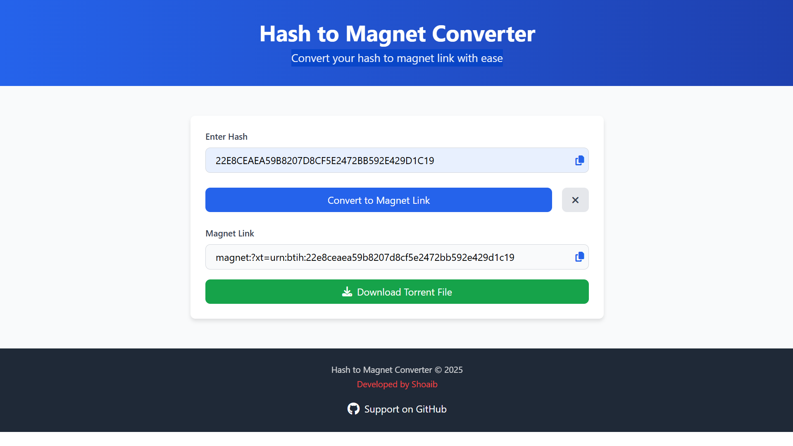

# 🔗 Hash to Magnet Converter

A simple and elegant web application that converts hash strings into magnet links and allows downloading them as `.torrent` files — all in a clean, responsive interface with **no backend required**.

---

## ✨ Features

- 🔄 Convert hash to magnet links instantly  
- 📋 One-click copy for both hash and magnet links  
- ⬇️ Download as `.torrent` file  
- 💻 Clean and responsive design  
- 🚫 No backend required — works 100% on the frontend  

---

## 📸 Preview

---

## 🚀 Live Demo

👉 [**View Live Demo**](https://shoaibxbwf.github.io/Hash2Magnet/)

---

## 🛠️ Usage

1. Paste or enter a hash in the input field  
2. Click on **Convert to Magnet Link**  
3. Copy the magnet link or download it as a `.torrent` file

---

## 🧰 Built With

- ⚛️ React 18  
- 🎨 TailwindCSS  
- ⭐ Font Awesome  

---

## 🤝 Contributing

Pull requests are welcome!  
For major changes, please open an issue first to discuss what you'd like to modify.

---

## 📄 License

This project is licensed under the [MIT License](https://choosealicense.com/licenses/mit/)

---

## 👨‍💻 Developed By

**Mohammad Amir Shoaib**  
💻 BCA Student | Front-End Web Developer  
📧 Email: [astechnical112@gmail.com](mailto:astechnical112@gmail.com)  
🌐 GitHub: [@shoaibxbwf](https://github.com/shoaibxbwf)
